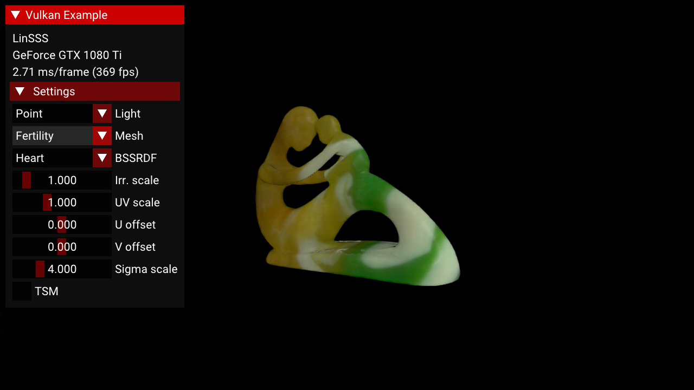
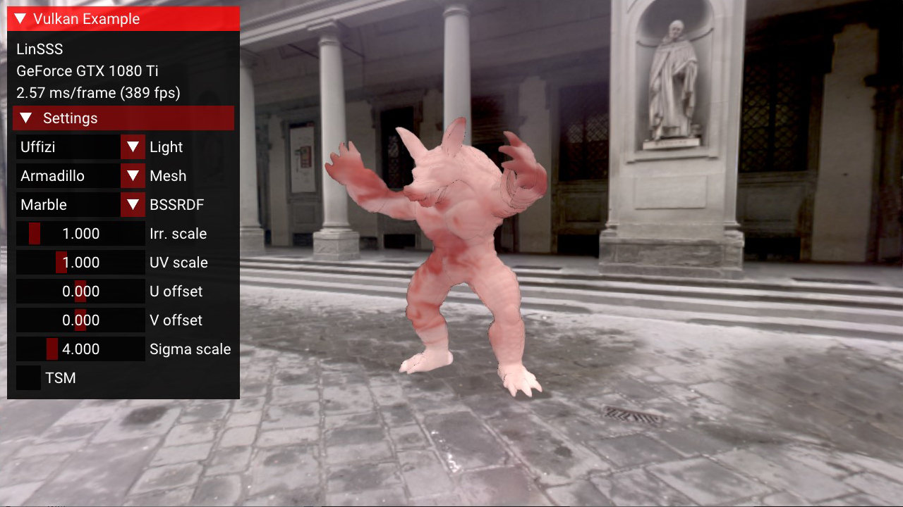

LinSSS
===

[](https://travis-ci.com/tatsy/LinSSS-Vulkan)
[](https://opensource.org/licenses/Apache-2.0)

This is a Vulkan implementation of LinSSS, a screen-space subsurface scattering for heterogeneous translucent materials.

> T. Yatagawa, Y. Yamaguchi, and S. Morishima, "LinSSS: Linear decomposition of heterogeneous subsurface scattering for real-time screen-space rendering", The Visual Computer, 2020.

For more detail, visit our project page: <https://tatsy.github.io/projects/yatagawa2020linsss/>

Build
---

### Tested environment

- Windows 10, Visual Studio 2019, LunarG Vulkan SDK 1.2.148.1
- MacOS 10.15 Catalina, Apple Clang 12.0, LunarG Vulkan SDK 1.2.148.1

### Setup

Clone this repository to your local disk.

```shell
$ git clone https://github.com/tatsy/linsss-vulkan.git --recursive
$ cd linsss-vulkan
```

Also, install `glslc` compiler for GLSL, and make sure you can run `glslc` in the terminal. Typically, `glslc` is bundled with Vulkan SDK, but is not included in that of MoltenVK. In this case, please install `glslc` from <https://github.com/google/shaderc>.

### Build

#### Windows

As well as the following commands, you can build the program with CMake GUI.

```shell
$ mkdir build
$ cd build
$ cmake -G "Visual Studio 16 2019" -a x64 ..
$ cmake --build . --config Release --parallel 4  # It takes much time! So, take a cup of coffee.
```

#### MacOS

A new flag `VK_USE_PLATFORM_MACOS_LUNARG` is added to use LunarG SDK rather than MoltenVK (default `ON`).
```shell
$ mkdir build && cd build
$ cmake -DCMAKE_BUILD_TYPE=Release -DVK_USE_PLATFORM_MACOS_LUNARG=ON ..
$ cmake --build . --parallel 4
```

When you inspect the program, to enable the validation layer with `-DVKB_VALIDATION_LAYERS=ON` will be helpful. For more options, refer to the [Vulkan-Samples documentation](https://github.com/KhronosGroup/Vulkan-Samples/tree/master/docs).

### Usage

From the root of this repo, run the `vulkan_sample` using the following command.

```shell
$ ./build/app/bin/release/AMD64/vulkan_samples --sample linsss
```

Screen Shot
---

<table>
  <tr>
    <td width="50%"><span class="font-weight: bold;">Point light</span></td>
    <td width="50%"><span class="font-weight: bold;">Uffizi gallery</span></td>
  </tr>
  <tr>
    <td></td>
    <td></td>
  </tr>
</table>

License
---

### LinSSS part

Apache License 2.0 (c) 2020, Tatsuya Yatagawa

### Framework part

This program is implemented on the top of [Vulkan-Samples](https://github.com/KhronosGroup/Vulkan-Samples).

> Copyright (c) 2019-2020, Arm Limited and Contributors
>
> SPDX-License-Identifier: Apache-2.0
>
> Licensed under the Apache License, Version 2.0 the "License";
> you may not use this file except in compliance with the License.
> You may obtain a copy of the License at
>
>     http://www.apache.org/licenses/LICENSE-2.0
>
> Unless required by applicable law or agreed to in writing, software
> distributed under the License is distributed on an "AS IS" BASIS,
> WITHOUT WARRANTIES OR CONDITIONS OF ANY KIND, either express or implied.
> See the License for the specific language governing permissions and
> limitations under the License.

### Environment maps

University of Southern California, The ICT Visual & Graphics Laboratory

<https://vgl.ict.usc.edu/Data/HighResProbes/>
